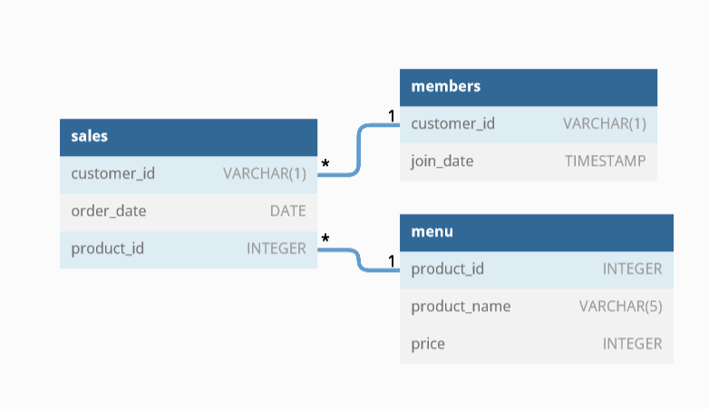

# Danny-s-Diner
First case study of 8 Week SQL Challenge

## Problem Statement
Danny wants to use the data to answer a few simple questions about his customers, especially about their visiting patterns, how much money they’ve spent and also which menu items are their favourite.
Danny has shared with you 3 key datasets for this case study:
-sales
-menu
-members

## Entity Relationship Diagram

